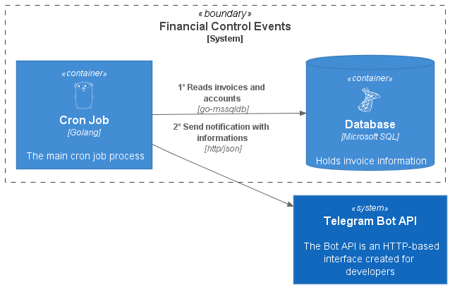

## Sobre
A ideia do projeto Financial Control Events nasceu com a necessidade de ser notificado com as despesas de cartões e contas mensais via telegram, trazendo a somatória de tudo que foi gasto no mês.

## Tecnologias Utilizadas 🚀
* **[Golang](https://golang.org/)**
* **[Cron Job](https://en.wikipedia.org/wiki/Cron)**
* **[Heroku](https://dashboard.heroku.com/)**
* **[GitHub Actions](https://docs.github.com/pt/actions)**
* **[Docker](https://www.docker.com/)**
* **[SQL Server](https://www.microsoft.com/pt-br/sql-server/sql-server-2019)**
* **[Telegram APIs](https://core.telegram.org/)**

## Desenho da Solução 🎨
<p align="center">
  
</p>

## Testes de unidade
Para gerar o arquivo coverage da aplicação
```
go test --coverprofile tests/coverage.txt ./...
go test --coverprofile tests/coverage.out ./...
```
Para gerar html com informações detalhadas do teste
```
go tool cover --html=tests/coverage.txt
go tool cover --html=tests/coverage.out
```

[](https://sonarcloud.io/dashboard?id=JailtonJunior94_financialcontrol-events)
[](https://sonarcloud.io/dashboard?id=JailtonJunior94_financialcontrol-events)
[](https://sonarcloud.io/dashboard?id=JailtonJunior94_financialcontrol-events)
[](https://sonarcloud.io/dashboard?id=JailtonJunior94_financialcontrol-events)
[](https://sonarcloud.io/dashboard?id=JailtonJunior94_financialcontrol-events)